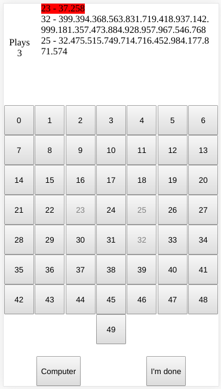

# Googol Game

...or "You should learn when to quit"! - A JavaScript game.

## About

After watching [this video](https://www.youtube.com/watch?v=OeJobV4jJG0), that tells you a good time to quit gambling, I decided to create a game to test the theory. 

This game is very simple: given N numbers, that could have the value 0 to googol (10 ** 100 | the number 1 with 100 zeros), you choose a number. You can go home with that number (if you think that is the biggest one) or you could choose another from the options. You last choice is your number! If you got a big number and decided to pick another one, you can't go back to the one you already had. When you think you have the biggest number, click "I'm done" and the game will answer if you have the biggest one or not.

## The experiment

The experiment on the video says that if you take all your options (N) and divede it to the euler's number e and round that to the next integer, the result will give you a good sample of all the values. So you keep picking numbers until you get one that is bigger than the ones you got from the sample. The video says that you'll then have a 1/3 probability of winning. Cool, right?! No?! Don't want to play? Ok, just click "Computer" and let the computer play for you.

## How to play

On the right top corner, where it says "Plays", it's the amount of numbers you already choosen.

Next to it, is a "history" log, with all the number you've selected, being the first one (the red line) your current number.

Bellow all that is the numbers: 1 - N, you just click one to select a number.

When you think you have the biggest number of all, click "I'm done" to see if you got it right.

The "Computer" button makes the computer play the game for you (it wins a lot).
